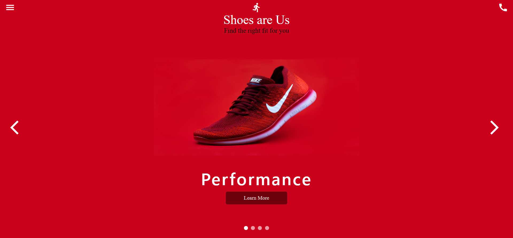
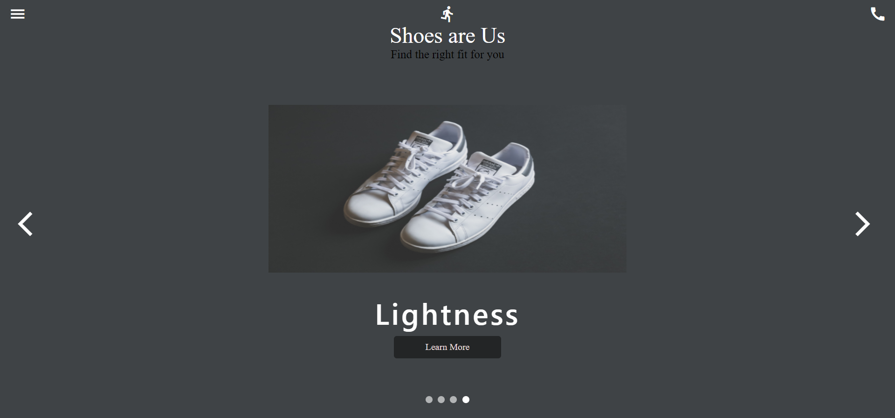

# Facebook UI Clone

A Facebook UI Clone with responsive design.

    </img>
    </img>

# YouTube UI Clone

A YouTube UI Clone with responsive design.

    </img>

# Automotive Car UI

An Automotive Car UI with responsive design.

    </img>

# Footwear UI

A Footwear UI with responsive design.

    </img>
    </img>

# Games Dashboard UI

A Games Dashboard UI.

    </img>

